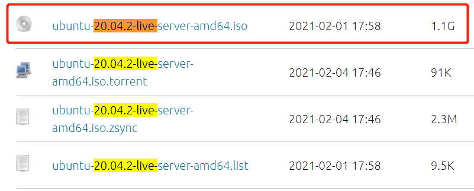

## CHAP0x01 无人值守Linux安装镜像制作
### 1.0 实验过程
#### 1.1 纯净版Ubuntu安装
- iso下载版本 :`ubuntu-20.04.2-live-server-amd64.iso`，下载完成后校验`SHA256`

- 挂载纯净版镜像，设置网卡为`NAT`和`Host-Only`，启动虚拟机安装

- 安装完成后登录，查看`ip`，`cmd端 用户名@ip`连接虚拟机

#### 1.2 无人值守配置
- 下载`autoinstall-user-data`，通过`sudo chown`授予权限，`scp`将文件拷贝至本机

- 对比`user-data`对`autoinstall-user-data`进行修改，进行无人值守的参数配置

- 创建`meta-data`空文件，将`meta-data`和`user-data`上传至虚拟机，命令为`sftp>put meta-data/user-data cuc@ip`（此处忘记截图了）
- 通过cmd，将虚拟机的`meta-data`和`user-data`合成为iso文件，
> 下载安装genisomage:`sudo apt install genisoimage`
> 合成iso:`genisoimage -output init.iso -volid cidata -joliet -rock user-data meta-data`

- 通过cmd的`sftp>get`，将合成的`init.ios`下载至本地

#### 1.3 无人值守自动安装
- 移除虚拟机`控制器：IDE`,在`控制器：SATA`下新建 2 个虚拟光盘，先挂载`纯净版 Ubuntu 安装镜像文件`后挂载`init.iso`

- 启动虚拟机，输入`yes`,进入无人值守安装

### 2.0 实验问题
- **访问*https://c4pr1c3.github.io/LinuxSysAdmin/exp/cloud-init/docker-compose/README.md*出现乱码**
    解决：google chrome-->更多工具--->网页另存为，markdown下载至本地用VScode即可正常显示。

### 3.0 参考资料
- **genisoimage命令 – 创建映像文件**:*https://www.linuxcool.com/genisoimage*
- **SFTP登录及命令行用法**:*https://www.cnblogs.com/afeige/p/12144296.html*
