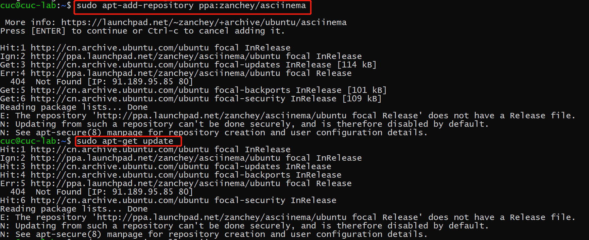
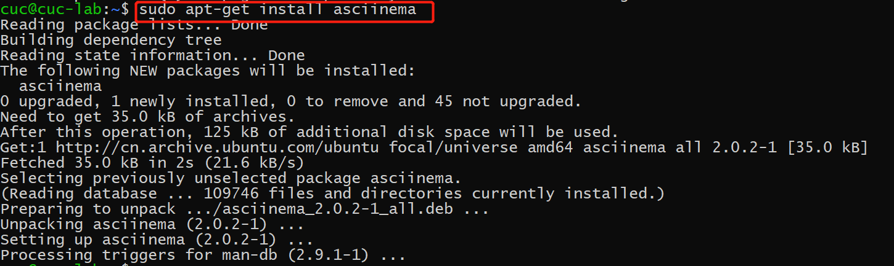

# CHAP0x02 Linux命令行使用基础
## 1. 实验目的
### (1) 熟悉配置使用asciinema
### (2) 通过vimtutor，学习掌握vim的基本操作
## 2. 实验过程
### (1) 配置asciinema

### (2) 实验视频

- Lesson 1.1-1.6 *https://asciinema.org/a/401168*
- Lesson 2.1-2.7 *https://asciinema.org/a/401172*
- Lesson 3.1-3.4 *https://asciinema.org/a/401177*
- Lesson 4.1-4.4 *https://asciinema.org/a/401181*
- Lesson 5.1-5.4 *https://asciinema.org/a/401246*
- Lesson 6.2-6.5 *https://asciinema.org/a/401254*
- Lesson 7.1-7.3 *https://asciinema.org/a/401263*

## 3. 问题回答
- **你了解vim有哪几种工作模式？**
①命令模式 ②插入模式 ③退出模式
- **Normal模式下，从当前行开始，一次向下移动光标10行的操作方法？如何快速移动到文件开始行和结束行？如何快速跳转到文件中的第N行？**
    - 向下移动光标10行：`10j`
    - 快速移动到文件开始行：`gg`
    - 快速移动到文件结束行：`G`
    - 快速跳转到文件中的第N行:`n(行数)G`
- **Normal模式下，如何删除单个字符、单个单词、从当前光标位置一直删除到行尾、单行、当前行开始向下数N行？**
    - 删除单个字符：`x`或`X`
    - 单个单词：`dw`
    - 从当前光标位置一直删除到行尾：`d$`
    - 单行：`dd`
    - 当前行开始向下数N行：`N(行数)dd`
- **如何在vim中快速插入N个空行？如何在vim中快速输入80个-？**
    - 快速插入N个空行：`N(行数)o`
    - 快速输入80个-：`80i/a-`
- **如何撤销最近一次编辑操作？如何重做最近一次被撤销的操作？**
    - 撤销最近一次编辑操作：`u`
    - 重做最近一次被撤销的操作：`CTRL+R`
- **vim中如何实现剪切粘贴单个字符？单个单词？单行？如何实现相似的复制粘贴操作呢？**
    - 用`v`选中，`y`复制，`p`粘贴
    - `de`复制当前单词，`d$`复制当前行
- **为了编辑一段文本你能想到哪几种操作方式（按键序列）？**
    -  `a` 在光标所在位置下一个字符开始输入
    -  `A` 在光标所在行尾开始输入
    -  `i` 在光标所在位置开始输入
    -  `I` 在光标所在行首开始输入
    -  `o` 在光标所在行下新增一行，并在新增行行首开始输入
    -  `O` 在光标所在行上新增一行，并在新增行行首开始输入
    - `x` 删除单个字符
- **查看当前正在编辑的文件名的方法？查看当前光标所在行的行号的方法？**
    - 查看文件名: `:f`/`:e`
    - 查看当前光标所在行的行号:`CRTL+G`
- **在文件中进行关键词搜索你会哪些方法？如何设置忽略大小写的情况下进行匹配搜索？如何将匹配的搜索结果进行高亮显示？如何对匹配到的关键词进行批量替换？**
    - 关键词搜索:`/`或`?`
    - 设置忽略大小写: `:set ic`
    - 将匹配的搜索结果进行高亮显示:`vim~/.vimrc`,在文件中加上`set hlsearch`
    - 对匹配到的关键词进行批量替换:`% s/XXX/YYY/g`
- **在文件中最近编辑过的位置来回快速跳转的方法？**
    - `'.`(单引号+点号)光标跳转到最后修改行
    - `` `.  ``(1左边那个键+点号) 光标跳转到最后修改点
    - `'"`(单引号+双引号)光标跳转到上一次离开该文件时的行
- **如何把光标定位到各种括号的匹配项？例如：找到(, [, or {对应匹配的),], or }**
    - `%`
- **在不退出vim的情况下执行一个外部程序的方法？**
    - `:!command` 例：`:!ls`
- **如何使用vim的内置帮助系统来查询一个内置默认快捷键的使用方法？如何在两个不同的分屏窗口中移动光标？**
    - 查询：`:help+快捷键`
    - 移动光标：`CTRL-W W` 移动光标至上方窗口
## 4. 参考资料
- [vimtutor教程(双语版)](https://blog.csdn.net/zhaoyu106/article/details/72896216)
- [Linux系统下vim常用快捷键及功能](https://blog.csdn.net/weixin_33972649/article/details/93318889)